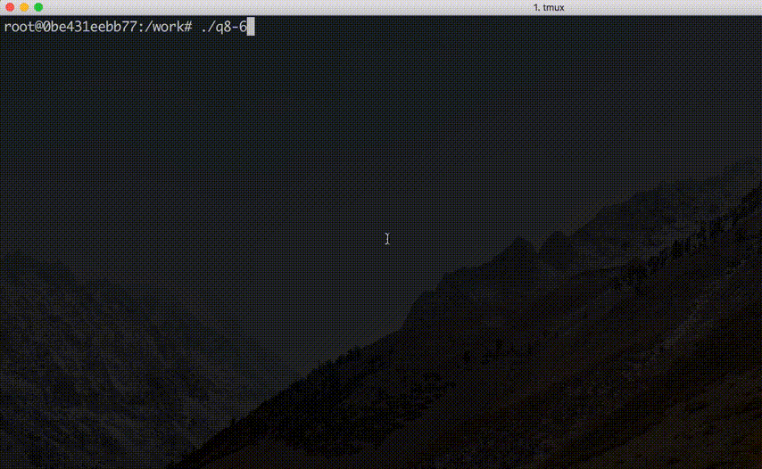

# 8 章. 配列の操作
<!--ts-->
   * [8 章. 配列の操作](#8-章-配列の操作)
   * [序章](#序章)
   * [1. スタック](#1-スタック)
      * [スタックについて](#スタックについて)
      * [スタックの構造](#スタックの構造)
      * [スタックの操作](#スタックの操作)
      * [スタックの実装例](#スタックの実装例)
   * [2. キュー](#2-キュー)
      * [キューについて](#キューについて)
      * [キューの構造](#キューの構造)
      * [キューの操作](#キューの操作)
      * [キューの実装例](#キューの実装例)
   * [3. ライフゲーム](#3-ライフゲーム)
      * [ライブゲームとは](#ライブゲームとは)
      * [ライフゲームの規則](#ライフゲームの規則)
      * [ライフゲームの実装例](#ライフゲームの実装例)
   * [演習問題](#演習問題)
      * [問 8.1](#問-81)
      * [問 8.2](#問-82)
      * [問 8.3](#問-83)
      * [問 8.4](#問-84)
      * [問 8.5](#問-85)
      * [問 8.6](#問-86)
   * [以上](#以上)

<!-- Added by: user, at: 2018-11-28T05:47+00:00 -->

<!--te-->
# 序章

* スタックとキューという基本的なデータ構造とその操作について学習する
* 配列を利用したスタックとキューの実装例について学ぶ
* コンウェイのライフゲームについても考察する

# 1. スタック

## スタックについて

* スタック (stack) とは最も基本的なデータ構造の一つである
* スタックには「積み重ねる」という意味がある

尚, スタックでは積み重なったデータの **1 つのデータしか読み取ることは出来ず**, 一度に読み取ることが出来るデータは, **最後にスタックに積まれた (挿入された) データだけ**である.

## スタックの構造

* 最初に積まれたデータは, スタックの底 (bottom: ボトム)
* 最後に積まれたデータは, スタックの頂上 (top: トップ)

このようなデータ構造は `LIFO` (Last In, First Out: 後出し先出し: ライフォ) と呼ばれ, `後入れ, 先出し` の構造で保存される.

## スタックの操作

以下のような基本操作がある.

* プッシュ (push): データをスタックの頂上に積む操作
* ポップ (pop): データをスタックの頂上から取り出す操作
* ピーク (peek): スタック頂上のデータを削除せずに, データ値を見る (覗く) 場合に使われる, トップ (top) と呼ぶこともある
* スワップ (swap): スタック頂上にあるデータと, その次にあるデータを入れ替える (交換) 操作
* ダップ (dup): スタック頂上にあるデータを複製 (duplicate) し, 複製したデータを頂上にプッシュする

## スタックの実装例

以下のコードは, 配列を使ってスタック構造を実装したもの. [こちら](http://compsci.world.coocan.jp/OUJ/2016AL/al2016web/ch08.html)より引用.

```c
/* code: ex8-1.c   (v1.16.00) */
#include<stdio.h>
#include<stdlib.h>
 
#define MAX 128
#define PUSH_SUCCESS    1
#define PUSH_FAILURE   -1
#define POP_SUCCESS     2
#define POP_FAILURE    -2
 
/* ------------------------------------------- */
void stack_init (int *top)
{
  *top = 0;
}
 
/* ------------------------------------------- */
void display (int stack[], int top)
{
  int i;
  printf ("STACK(%d): ", top);
  for (i = 0; i < top; i++) {
    printf ("%d ", stack[i]);
  }
  printf ("\n");
}
 
/* ------------------------------------------- */
int push (int stack[], int *top, int data)
{
  if (*top >= MAX) {
    /* stack overflow */
    return PUSH_FAILURE;
  }
  else {
    stack[*top] = data;
    (*top)++;
    return PUSH_SUCCESS;
  }
}
 
/* ------------------------------------------- */
int pop (int stack[], int *top, int *data)
{
  if ((*top) > 0) {
    *data = stack[(*top) - 1];
    (*top)--;
    return POP_SUCCESS;
  }
  else {
    /* stack empty */
    return POP_FAILURE;
  }
}
 
/* ------------------------------------------- */
int main ()
{
  int stack[MAX];
  int top, data;
 
  stack_init (&top);
  data = 300;
  printf ("push: %d\n", data);
  push (stack, &top, data);
  data = 400;
  printf ("push: %d\n", data);
  push (stack, &top, data);
  data = 500;
  printf ("push: %d\n", data);
  push (stack, &top, data);
  display (stack, top);
  pop (stack, &top, &data);
  printf ("pop:  %d\n", data);
  pop (stack, &top, &data);
  printf ("pop:  %d\n", data);
  pop (stack, &top, &data);
  printf ("pop:  %d\n", data);
  return 0;
}
```

これをコンパイルして実行してみる.

```sh
root@0be431eebb77:/work# gcc ex8-1.c -g3 -o ex8-1
root@0be431eebb77:/work# ./ex8-1
push: 300
push: 400
push: 500
STACK(3): 300 400 500
pop:  500
pop:  400
pop:  300
```

# 2. キュー

## キューについて

* キュー (queue: 待ち行列), 「列に並んで待つこと」を意味する
* スタックと類似した構造を持っている
* 最初に挿入したデータが最初に取り出される構造

## キューの構造

* 最初のデータは, キューの先頭 (front)
* 最後のデータは, キューの末尾 (rear)

このようなデータ構造は `FIFO` (First In, First Out: 先出し先出し: フィフォ) と呼ばれ, `先入れ, 先出し` の構造で保存される.

## キューの操作

以下のような基本操作がある.

* エンキュー (enqueue): データをキューの末尾に入れる
* デキュー (dequeue): キューの先頭からデータを取り出す
* ピーク (peek: 覗く): キューの先頭データを削除せず, データ値を見る場合に使われる, front と呼ぶこともある

## キューの実装例

以下のコードは, 配列を使ってキュー構造を実装したもの. [こちら](http://compsci.world.coocan.jp/OUJ/2016AL/al2016web/ch08.html)より引用.

```c
/* code: ex8-2.c   (v1.16.00) */
#include<stdio.h>
#include<stdlib.h>
 
#define MAX 128
#define ENQUEUE_SUCCESS     1
#define ENQUEUE_FAILURE    -1
#define DEQUEUE_SUCCESS     2
#define DEQUEUE_FAILURE    -2
 
/* ------------------------------------------- */
void queue_init (int *front, int *rear)
{
  *front = -1;
  *rear = -1;
}
 
/* ------------------------------------------- */
int enqueue (int q[], int *rear, int data)
{
  if (*rear < MAX - 1) {
    *rear = *rear + 1;
    q[*rear] = data;
    return ENQUEUE_SUCCESS;
  }
  else {
    return ENQUEUE_FAILURE;
  }
}
 
/* ------------------------------------------- */
int dequeue (int q[], int *front, int rear, int *data)
{
  if (*front == rear) {
    return DEQUEUE_FAILURE;
  }
  *front = *front + 1;
  *data = q[*front];
  return DEQUEUE_SUCCESS;
}
 
/* ------------------------------------------- */
int main ()
{
  int queue[MAX];
  int front, rear, data;
  int stat;
 
  queue_init (&front, &rear);
  enqueue (queue, &rear, 100);
  enqueue (queue, &rear, 200);
  enqueue (queue, &rear, 300);
  enqueue (queue, &rear, 400);
  enqueue (queue, &rear, 500);
  while (rear - front) {
    stat = dequeue (queue, &front, rear, &data);
    if (stat == DEQUEUE_SUCCESS) {
      printf ("%d\n", data);
    }
    else {
      printf ("QUEUE is empty\n");
    }
  }
  return 0;
}
```

これをコンパイルして実行してみる.

```sh
root@0be431eebb77:/work# gcc ex8-2.c -g3 -o ex8-2
root@0be431eebb77:/work# ./ex8-2
100
200
300
400
500
```

エンキューとデキューの操作によっては, 先頭と末尾の位置関係から大きな配列が必要になってしまうことがある為, 配列の先頭と末尾が連続的に接続した循環構造として扱う, リングバッファ (ring buffer 又は, circular buffer: 環状バッファ) と呼ばれる構造が一般的に使われることが多い.

# 3. ライフゲーム

## ライブゲームとは

* 1970 年にジョン・ホートン・コンウェイ博士が考案した ([https://ja.wikipedia.org/wiki/%E3%83%A9%E3%82%A4%E3%83%95%E3%82%B2%E3%83%BC%E3%83%A0:title])
* コンウェイのライフゲームはセルオートマトン (セルラーオートマトン) とも呼ばれる例として有名 ([https://ja.wikipedia.org/wiki/%E3%82%BB%E3%83%AB%E3%83%BB%E3%82%AA%E3%83%BC%E3%83%88%E3%83%9E%E3%83%88%E3%83%B3:title])
* 2 次元の正方形のセルで分割される無限の空間で実行される
* 各セルは alive と dead の何れかの状態を持ち, これらの状態は世代毎に変化してく
* 変化の要因はセルの近傍 (きんぼう) にあるセルの状態に依存している
* 近防にあるセルとは, 下図のような, セルに接している水平方向, 垂直方向, 斜め方向にあるセルの合計 8 個が近傍セルとなる (Moor 近傍 (Moore neighborhood) と呼ばれる)


## ライフゲームの規則

* 初期のセルの配置は第一世代と考えることが出来る
* 第二世代目の配置は, セルの近傍にあるセルの状態と規則に基づき決定される
* 規則は全てのセルに対して同時に実行される

以下, 標準的な規則.

* 生存セルに隣接する生存セルが 2 個以下の場合, 次の世代で, セルは死滅 (die of loneliness) する (セル数: 0 〜 1)
* 生存セルに隣接する生存セルが 3 個以上の場合, 次の世代ではセルは死滅 (die of overcrowding) する (セル数: 4 〜 8)
* 生存セルに隣接する生存セルが 2 個, 又は, 3 個である場合, 次の世代でもセルは生存 (survive to next generation) する (セル数: 2 〜 3)
* 死んだセルに隣接する生存セルが 3  個である場合, 次の世代でセルが誕生 (birth) する (セル数: 3)

セルの配置によって, 世代ごとにセルのパターンには様々な変化が起きる.

## ライフゲームの実装例

[こちら](http://compsci.world.coocan.jp/OUJ/2016AL/al2016web/ch08.html)より引用.

```c
/* code: ex8-3.c   (v1.16.00) */
#include <stdio.h>
#include <stdlib.h>
#define WIDTH  40
#define HEIGHT 20
 
/* ------------------------------------------- */
void cell_evolve (int array[HEIGHT][WIDTH])
{
  int array_new[HEIGHT][WIDTH];
  int x, y, n, x_width, y_height;
 
  for (y = 0; y < HEIGHT; y++) {
    for (x = 0; x < WIDTH; x++) {
      n = 0;
      for (y_height = y - 1; y_height <= y + 1; y_height++) {
    for (x_width = x - 1; x_width <= x + 1; x_width++) {
      if (array[(y_height + HEIGHT) % HEIGHT][(x_width + WIDTH) % WIDTH]) {
        n++;
      }
    }
      }
      if (array[y][x]) {
    n--;
      }
      array_new[y][x] = (n == 3 || (n == 2 && array[y][x]));
    }
  }
 
  for (y = 0; y < HEIGHT; y++) {
    for (x = 0; x < WIDTH; x++) {
      array[y][x] = array_new[y][x];
    }
  }
}
 
/* ------------------------------------------- */
void cell_first_generation (int array[HEIGHT][WIDTH])
{
  int x, y, r;
  for (x = 0; x < WIDTH; x++) {
    for (y = 0; y < HEIGHT; y++) {
      r = RAND_MAX / 8;
      if (rand () < r) {
    array[y][x] = 1;
      }
      else {
    array[y][x] = 0;
      }
    }
  }
}
 
/* ------------------------------------------- */
void cell_print (int array[HEIGHT][WIDTH], int generation)
{
  int x, y;
  printf ("[Generation: %05d]\n", generation);
  for (y = 0; y < HEIGHT; y++) {
    for (x = 0; x < WIDTH; x++) {
      if (array[y][x] == 1) {
    printf ("*");
      }
      else {
    printf (".");
      }
    }
    printf ("\n");
  }
  printf ("\n");
  fflush (stdout);
}
 
/* ------------------------------------------- */
int main ()
{
  int i;
  int array[HEIGHT][WIDTH];
  cell_first_generation (array);
  i = 0;
  while (i < 100) {
    cell_print (array, i);
    cell_evolve (array);
    i++;
  }
  return 0;
}
```

これをコンパイルして実行する.

```sh
root@0be431eebb77:/work# gcc ex8-3.c -g3 -o ex8-3


[Generation: 00000]
.*....**...........**.............*...*.
..............*..*......................
.......**........*..........*..*........
.................................*.....*
........................*..............*
.........*...*..*......**..*.....*......
...............................*..*.....
.*.........**....*.*...............*....
..*................*...........*...*...*
........*.*..*.......*..........**......
.............**............**........**.
..**....*.............*.....*....*....*.
.......**.............................*.
..................*........*.......**...
.........*.........*....................
.......*...*.......*..........*...*....*
..*....*............*..............*....
..*...............*.*..*................
..........*..........*.*................
..*...................................*.

...

[Generation: 00099]
............*..*..*.....................
...........**.**.*.*....................
...........**....*.*....................
..............*****.....................
.......*****..**.......**...............
......*.**.............**...............
......*..****.....................**....
.......**.*..*....................**....
.........*.**...........................
.........*.**...........................
..........*................**...........
...........................**...........
........................................
................**......................
................**......................
........................................
........................................
...................*....................
..................**....................
................**.*....................
```

ライフゲームをコンピュータプログラムといて実装するには, 格子状に分割されたセル空間で各セルの状態を保存する必要がある. セル空間の広さを限定すれば, 2 次元配列を利用すれば, 比較的容易に実装が可能である. 上記のコードでは, セルオートマトンはセルの状態は同時に更新される同期性の特徴がある為, 2 つの配列 (`array` と `array_new`) が必要である点に注意する.

# 演習問題

## 問 8.1

スタックの重要な操作を 2 つ答えなさい.

* プッシュ (push): データをスタックの頂上に積む操作
* ポップ (pop): データをスタックの頂上から取り出す操作

## 問 8.2

キューの重要な操作を 2 つ答えなさい.

* エンキュー (enqueue): データをキューの末尾に入れる
* デキュー (dequeue): キューの先頭からデータを取り出す

## 問 8.3

スタックに, 5 つのデータ 30, 20, 40, 50, 10 を順番にプッシュ (push) すると, スタック頂上のデータは 10 となる. このスタックから, ポップ (pop) を 3 回行うと, スタック頂上にあるデータは何か答えなさい.

これは, C で書けないので Ruby で解いてみたのが以下.

```ruby
$ irb
irb(main):001:0> a = [30, 20, 40, 50, 10]
=> [30, 20, 40, 50, 10]
irb(main):002:0> a.pop
=> 10
irb(main):003:0> a.pop
=> 50
irb(main):004:0> a.pop
=> 40
irb(main):005:0> p a
[30, 20]
=> [30, 20]
```

スタックの頂上 (配列の最後尾) にあるデータは 20 になる. 尚, Ruby の pop メソッドは配列の末尾の要素を削除して, その要素を返す.

## 問 8.4

キューのデータ構造では, 最初に挿入したデータが, 最初に取り出される構造になる. 空のキューに 5 つのデータ 380, 370, 390, 350, 360 を順番にエンキューすると, キューの先頭データは 380, キューの末尾データは 360 となる. このキューからデキューを 3 回行うと, キューの先頭にあるデータは何か答えなさい.

とりあえず, これも Ruby で解いてみた.

```ruby
irb(main):011:0> b = [380, 370, 390, 350, 360]
=> [380, 370, 390, 350, 360]
irb(main):012:0> b.shift
=> 380
irb(main):013:0> b.shift
=> 370
irb(main):014:0> b.shift
=> 390
irb(main):015:0> p b
[350, 360]
=> [350, 360]
```

配列 (キュー) の先頭は 350 となる. Ruby の shift メソッドは配列の先頭の要素を削除して, その要素を返す.

## 問 8.5

リングバッファによるキューの実装を考えなさい. リングバッファでは, 配列の添字をバッファの大きさで割って剰余を取る計算が使われる. これによって, 計算上, 直線バッファの両端がつながり円環状になる.

コードは[こちら](http://compsci.world.coocan.jp/OUJ/2016AL/al2016web/ch08.html)を参照. 実際に実行してみると, 以下のような結果となる.

```sh
root@0be431eebb77:/work# gcc q8-5.c -g3 -o q8-5
root@0be431eebb77:/work# ./q8-5
100
200
300
400
500
```

データのエンキュー時に, 変数 rear と配列の最大要素数のモジュロ演算を行い, その値を配列の添字にすることによって, リングバッファを実現している.

```c
// 以下, コードより抜粋
...
/* ------------------------------------------- */
int rb_enqueue (int q[], int *front, int *rear, int data)
{
  int index_f, index_r, index_q;
  index_f = *front % MAX;
  index_r = (*rear + 1) % MAX;
  if (index_f != index_r) {
    index_q = (*rear)++ % MAX;
    q[index_q] = data;
    return ENQUEUE_SUCCESS;
  }
  else {
    return ENQUEUE_FAILURE;
  }
}
...
```

これにより, 配列の末尾が次の配列の先頭になるか, 配列の先頭の前が配列の末尾となるようだ.

## 問 8.6

エスケープシーケンスによる画面制御, または, OpenGL 等のグラフィックスライブラリを利用してコード 8.3 のライブゲームの出力を工夫しなさい.

コードは[こちら](http://compsci.world.coocan.jp/OUJ/2016AL/al2016web/ch08.html)を参照. 実際に実行してみると, 以下のような結果となる.



エスケープシーケンスによる画面制御を用いた例. おお〜.

# 以上

* スタックやキューは配列を利用して表現することが出来る
* スタックは後入れ先出し, キューは先入れ先出し
* ライフゲーム, まだちゃんと理解出来ていないけど... 見てて面白いし, 2 次元配列の実装だけで表現出来ることに驚いた
